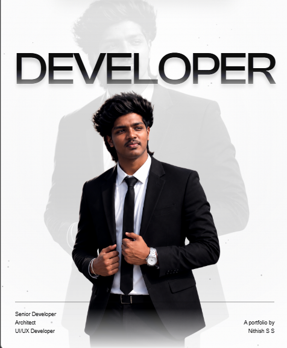
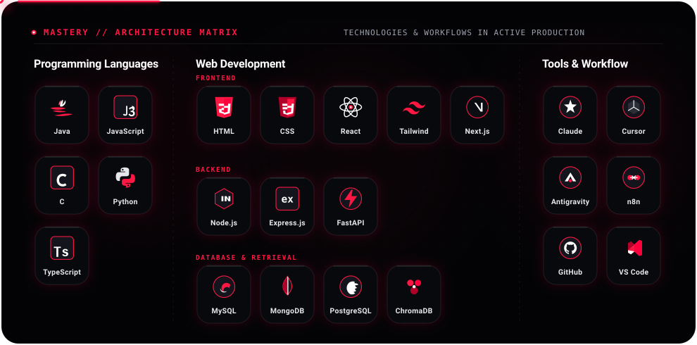
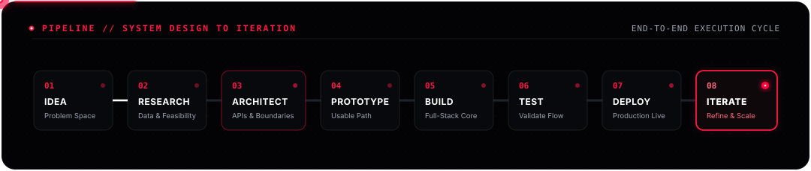
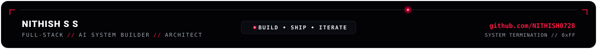

  

  

   &nbsp;
   &nbsp;
   &nbsp;
   &nbsp;
  

 

## ● `01` // ABOUT
> **SYSTEM PROFILE** · *Engineering background, focus areas & credentials*

<table>
  <tr>
    <td width="34%" align="center" valign="middle">
      
    </td>
    <td width="66%" valign="top">
      

        I'm <b>Nithish S S</b>, a full-stack developer building learning platforms, AI-assisted product discovery, and interfaces for the web. My work connects React and TypeScript frontends with Python APIs, structured data, and retrieval workflows—with attention to how the finished product feels to use.
      

      

        Through <b><a href="https://tnwebz.com/">TNWebz</a></b>, my freelancing initiative, I build websites and web applications for businesses.
      

      <table>
        <tr>
          <th align="left">CONTEXT</th>
          <th align="left">DETAILS</th>
        </tr>
        <tr>
          <td><b>Focus</b></td>
          <td>Full-stack development · AI-assisted systems · UI/UX</td>
        </tr>
        <tr>
          <td><b>Education</b></td>
          <td>B.E. Computer Science and Engineering</td>
        </tr>
        <tr>
          <td><b>College</b></td>
          <td>St. Joseph's College of Engineering · 2024–2028</td>
        </tr>
        <tr>
          <td><b>Based in</b></td>
          <td>Tamil Nadu, India</td>
        </tr>
      </table>
       
      
    </td>
  </tr>
</table>

 

## ● `02` // ENGINEERING STACK
> **ILLUMINATED ARCHITECTURE MATRIX** · *Technologies, frameworks & tooling in active production*

  

  
<b>View Stack Specification Table</b>

   

| AREA | TECHNOLOGIES USED IN MY PROJECTS |
| :--- | :--- |
| **Languages** | Python · TypeScript · JavaScript · Java · C · HTML · CSS |
| **Frontend & Interfaces** | React · Next.js · Vite · Tailwind CSS · Framer Motion |
| **Backend & APIs** | FastAPI · Python · Node.js · Express.js |
| **AI & Retrieval** | ChromaDB · Sentence Transformers · Groq · RAG Architectures |
| **Databases** | PostgreSQL · MongoDB · MySQL |
| **Tools & Platforms** | Git · GitHub · VS Code · Cursor · Claude · Antigravity |

 

## ● `03` // FEATURED SYSTEMS
> **SELECTED ENGINEERING WORK** · *Architected systems, intelligent retrieval & product platforms*

<table>
  <tr>
    <td width="68%" valign="top">
      

        <b>PROJECT // 01</b> &nbsp;
        ●
      

      <h3>SHOPSMART AI</h3>
      
<b>Product catalogs → semantic retrieval → conversational discovery</b>

      

        A shopping assistant that connects natural-language questions to a product catalog. The backend validates and chunks product data, generates local embeddings, and stores vectors in ChromaDB. Retrieval feeds a Groq-backed chat workflow, with dedicated ingestion and retrieval tests.
      

      

        
      

    </td>
    <td width="32%" valign="top">
      

        SYSTEM ARCHITECTURE 
        <b>RAG / Vector Retrieval</b>
      

      

        CORE STACK 
        <code>React</code> · <code>TypeScript</code> 
        <code>FastAPI</code> · <code>Python</code> 
        <code>ChromaDB</code> · <code>Groq</code>
      

      

        DEPLOYMENT STATUS 
        ● <b>Active &amp; Validated</b>
      

    </td>
  </tr>
</table>

<table>
  <tr>
    <td width="68%" valign="top">
      

        <b>PROJECT // 02</b> &nbsp;
        ●
      

      <h3>SKILLFORGE</h3>
      
<b>Course authoring → learning → coding practice</b>

      

        A comprehensive learning management platform with course-building interfaces, student and instructor dashboards, assignments, and an interactive code arena. A React frontend connects to a Python backend; the repository also includes browser-based Python execution utilities.
      

      

        
      

    </td>
    <td width="32%" valign="top">
      

        SYSTEM ARCHITECTURE 
        <b>EdTech Platform / Code Arena</b>
      

      

        CORE STACK 
        <code>React</code> · <code>TypeScript</code> 
        <code>Vite</code> · <code>Tailwind CSS</code> 
        <code>FastAPI</code> · <code>Python</code>
      

      

        DEPLOYMENT STATUS 
        ● <b>Production Active</b>
      

    </td>
  </tr>
</table>

<table>
  <tr>
    <td width="68%" valign="top">
      

        <b>PROJECT // 03</b> &nbsp;
        ●
      

      <h3>TNWEBZ / FREELANCING</h3>
      
<b>Business ideas → designed and developed web experiences</b>

      

        My freelance initiative and digital studio delivering modern web applications, high-converting business portals, and bespoke digital solutions for companies.
      

      

         &nbsp;
        
      

    </td>
    <td width="32%" valign="top">
      

        SERVICE MODEL 
        <b>Client Solutions / Studio</b>
      

      

        CORE STACK 
        <code>Next.js</code> · <code>React</code> 
        <code>TypeScript</code> · <code>Tailwind CSS</code> 
        <code>Framer Motion</code>
      

      

        DIRECT CONTACT 
        <a href="mailto:tnwebzz@gmail.com"><b>Discuss a project ↗</b></a>
      

    </td>
  </tr>
</table>

 

## ● `04` // HOW I BUILD
> **ENGINEERING LIFECYCLE** · *From problem definition to scalable iteration*

  

**Idea → Research → System design → Prototype → Implement → Test → Deploy → Iterate**

Start with the problem. Define the data and service boundaries. Build a usable path through the system, validate its behavior, and refine the experience.

 

## ● `05` // DEVELOPMENT TELEMETRY
> **ACTIVITY TRACE & REPOSITORIES** · *Engineering output & commit signals*

  

  <a href="https://github.com/NITHISH0728?tab=overview"><b>Contribution activity ↗</b></a> &nbsp; · &nbsp;
  <a href="https://github.com/NITHISH0728?tab=repositories"><b>Public repositories ↗</b></a>

 

## ● `06` // CURRENT ENGINEERING FOCUS
> **ACTIVE INITIATIVES** · *Core technical domains & research tracks*

- **Retrieval-assisted software:** Product ingestion pipelines, semantic vector search with ChromaDB, and conversational discovery interfaces.
- **Interactive learning systems:** Course authoring workflows, assignment telemetry, and browser sandboxes for code execution.
- **Product engineering & client solutions:** High-fidelity, responsive web applications and business platforms engineered through TNWebz.

 

## ● `07` // ESTABLISH CONNECTION
> **COLLABORATION & INQUIRIES** · *Open for software engineering opportunities and freelance contracts*

Interested in full-stack software, AI-assisted products, or a high-performance web experience for your business?

**Freelance Inquiries → [TNWebz](https://tnwebz.com) &nbsp;·&nbsp; [tnwebzz@gmail.com](mailto:tnwebzz@gmail.com)**

   &nbsp;
   &nbsp;
   &nbsp;
   &nbsp;
  

  

